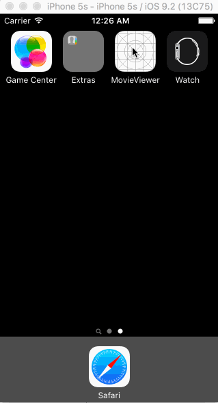

# Project 1 - *Movie Viewer*

**Movie Viewer** is a movies app using the [The Movie Database API](http://docs.themoviedb.apiary.io/#).

Time spent: **14** hours spent in total

## User Stories

The following **required** functionality is complete:

- [x] User can view a list of movies currently playing in theaters from The Movie Database.
- [x] Poster images are loaded using the UIImageView category in the AFNetworking library.
- [x] User sees a loading state while waiting for the movies API.
- [x] User can pull to refresh the movie list.

The following **optional** features are implemented:

- [ ] User sees an error message when there's a networking error.
- [ ] Movies are displayed using a CollectionView instead of a TableView.
- [ ] User can search for a movie.
- [ ] All images fade in as they are loading.
- [ ] Customize the UI.

The following **additional** features are implemented:

- [x] Added styling to UI with fonts and colors.

## Video Walkthrough 

Here's a walkthrough of implemented user stories:

GIF created with [LiceCap](http://www.cockos.com/licecap/).

## Notes

Describe any challenges encountered while building the app.
I had trouble trying to implement the optional user stories; would need to devote them more time and research in the future.
## License

    Copyright [2016] [Juan Hernandez]

    Licensed under the Apache License, Version 2.0 (the "License");
    you may not use this file except in compliance with the License.
    You may obtain a copy of the License at

        http://www.apache.org/licenses/LICENSE-2.0

    Unless required by applicable law or agreed to in writing, software
    distributed under the License is distributed on an "AS IS" BASIS,
    WITHOUT WARRANTIES OR CONDITIONS OF ANY KIND, either express or implied.
    See the License for the specific language governing permissions and
    limitations under the License.
    
  

# Project 2 - *Movie Viewer - Part 2*

**Movie Viewer** is a movies app displaying box office and top rental DVDs using [The Movie Database API](http://docs.themoviedb.apiary.io/#).

Time spent: **22** hours spent in total

## User Stories

The following **required** functionality is completed:

- [x] User can view movie details by tapping on a cell.
- [x] User can select from a tab bar for either **Now Playing** or **Top Rated** movies.
- [x] Customize the selection effect of the cell.

The following **optional** features are implemented:

- [x] For the large poster, load the low resolution image first and then switch to the high resolution image when complete.
- [x] Customize the navigation bar.

The following **additional** features are implemented:

- [x] User can search for a movie (from previous week's optional user stories).

Please list two areas of the assignment you'd like to **discuss further with your peers** during the next class (examples include better ways to implement something, how to extend your app in certain ways, etc):

1. I would like to keep working on some optional features from the previous week that I haven't been able to implment. 
2. 

## Video Walkthrough 

Here's a walkthrough of implemented user stories:

![walkthrough] (movie_viewer_week2Final.gif)

GIF created with [LiceCap](http://www.cockos.com/licecap/).

tickets by Arthur Lacôte from the Noun Project

movie star by Studio Fibonacci from the Noun Project

## Notes

Describe any challenges encountered while building the app.

It was a bit tricky to implement loading low resolution images first. 

## License

    Copyright [2016] [Juan Hernandez]

    Licensed under the Apache License, Version 2.0 (the "License");
    you may not use this file except in compliance with the License.
    You may obtain a copy of the License at

        http://www.apache.org/licenses/LICENSE-2.0

    Unless required by applicable law or agreed to in writing, software
    distributed under the License is distributed on an "AS IS" BASIS,
    WITHOUT WARRANTIES OR CONDITIONS OF ANY KIND, either express or implied.
    See the License for the specific language governing permissions and
    limitations under the License.
